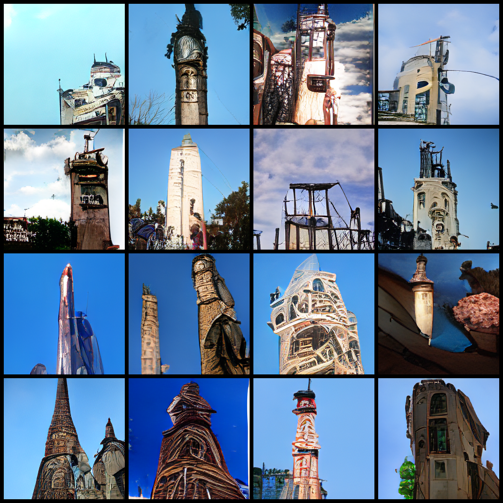

# DALLE

此仓库包含MegEngine实现的多模态模型DALLE以及文生图代码，但不包含训练代码。

## 图像重建

对于给定的大小为256x256的归一化四维输入，可以使用如下方式进行重建：

```python
from official.multimodal.dalle.vae import OpenAIDiscreteVAE
from official.multimodal.big_sleep.big_sleep import save_images


vae = OpenAIDiscreteVAE(True)

img_seq = vae.get_codebook_indices(input)

reconstructed_image = vae.decode(img_seq)

save_images(reconstructed_image, './image.png')

```


## 文生图

可以使用以下代码体验文生图的功能，需要先下载[dalle_new_variety.bpe](https://data.megengine.org.cn/research/multimodality/dalle_new_variety.bpe)文件

```python
from official.multimodal.dalle import coco_512_16_16d_16h_80tsl
from official.multimodal.dalle import Generator

dalle = coco_512_16_16d_16h_80tsl()

generator = Generator(
    dalle,
    texts = ['A tower has a clock on it on a day with a blue sky'],
    num_images=64,
    batch_size=4,
    bpe_path = './dalle_new_variety.bpe',
    root='./dalle'
)

generator()
```

生成结果如下所示：




## 参考

[DALLE-pytorch](https://github.com/lucidrains/DALLE-pytorch)

[DALLE-pytorch-discussions](https://github.com/lucidrains/DALLE-pytorch/discussions/335)
