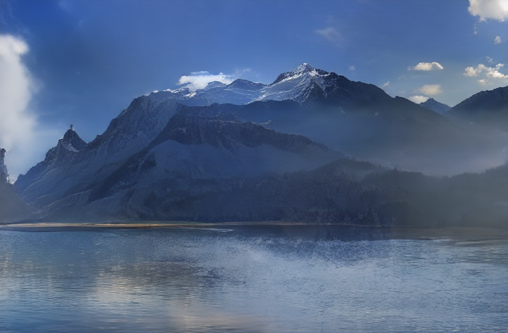
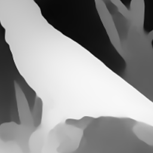
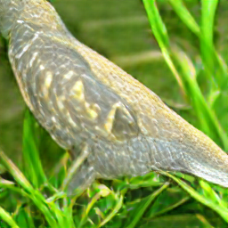
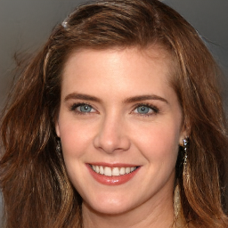
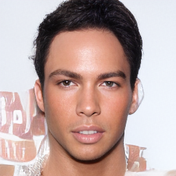

# Taming Transformer

此仓库包含MegEngine实现的`taming_transformer`模型代码及推理代码，但不包含训练代码。`taming_transformer`通过`VQGAN`将卷积的高效性和`Transformer`极强的表达能力相结合，拥有强大的图像重建和高分辨率图像合成能力。

## 图像重建

我们可以使用`VQGAN`来测试图像重建，`VQGAN`的结构参考与`Diffusion Model`，并且使用GAN的方式进行训练。其主要拥有两种不同的模型——`VQModel`和`GumbelVQ`，主要区别在于模型中的`quantize离散化`部分，`VQModel`使用`VQVAE`中的离散化方法，`GumbelVQ`则使用`Gumbel Softmax`进行离散化。

我们可以很方便的使用如下代码进行图像重建。

```python
from official.multimodal.taming_transformer import Reconstruction

# 加载模型及权重
model = vqgan_imagenet_f16_16384(pretrained=True)

# 传入模型
rec = Reconstruction(model)

image_path: str = ...
# 传入图片路径和保存路径
reconstructed_image = rec(image_path, file_name='reconstructed_image.png')
```

## 从分割图采样

`taming_transformer`可以利用分割图作为引导，逐步的从噪声中进行采样。可以使用如下代码进行采样。

```python
from official.multimodal.taming_transformer import s_flckr_transformer
# 加载模型及权重
model = s_flckr_transformer(pretrained=True)

sampler = ConditionalSampler(
    model,
    temperature=1.0,
    top_k=100,
    update_every=50, # 多少次采样保存一次图片
    scale_factor=1.0, # 对输入图片进行缩放
    animate=True, # 保存采样过程为mp4
    root='test', # 根目录，用于保存采样过程中的文件和视频
    seed=2022, # 固定随机种子
    kernal_size=16, # 每次采样的窗口大小，越大效果越好
    fps=15, # 保存视频的帧率
    segmentation_save=True # 为分割图使用专门的保存方式，保证每次推理保存的分割图色彩一致
)

# 可以在official/multimodal/taming_transformer/data目录下找到更多图片
segmentation_path: str = r"official/multimodal/taming_transformer/data/sflckr_segmentations/norway/25735082181_999927fe5a_b.png"
# 传入分割图地址
sampler.sample_segmentation(segmentation_path, name='norway')
```

分割图如下所示：


采样结果如下所示：

多次运行即可获得更多样的结果

采样过程：

<iframe height=512 width=1024 src="../../assets/norway_sampling.mp4">

## 从深度图采样

与从分割图采样类似，传入深度图即可进行引导

```python
model = drin_transformer(pretrained=True)

sampler = ConditionalSampler(
    model,
    temperature=1.0,
    top_k=100,
    root='test'
)
depth_path: str = r"official/multimodal/taming_transformer/data/drin_depth/n01819313/ILSVRC2012_val_00003068.png"
# 传入深度图地址
sampler.sample_segmentation(depth_path, name='test')

```

深度图如下所示：



采样结果：



采样过程：

<iframe height=512 width=1024 src="../../assets/test_sampling.mp4">

## 无条件采样（Unconditional Sample）

无条件采样不需要任何数据，只需要通过以下代码设置采样参数即可。

```python

# 加载模型及权重
model = celebahq_transformer(pretrained=True)

sampler = FastSampler(
    model,
    batch_size=25,
    temperature=1.0,
    top_k=250,
    top_p=1.0,
    num_samples=50000, # 采样图片个数
    class_labels=None # 仅在classs-conditonal sample中使用
    steps=256, # 每个图片采样的步数
    root='celebahq', # 根目录，用于保存采样过程中的图片
    seed=2022, # 固定随机种子
)

sampler(
    dim_z=256,
    h=16,
    w=16, #  w*h == steps
    name='test'
)
```

采样结果：





## 参考

[taming_transformers](https://github.com/CompVis/taming-transformers)
