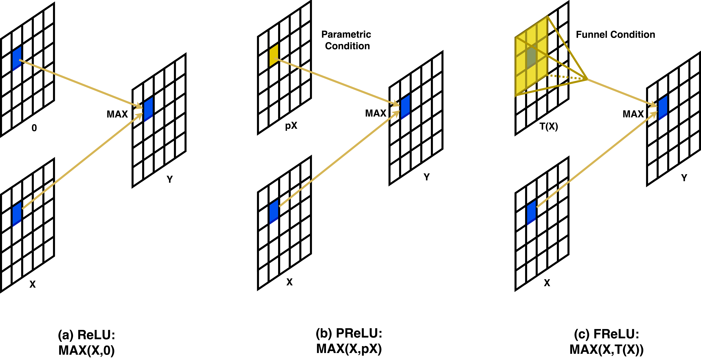
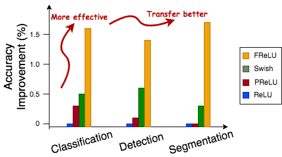

# [Funnel Activation for Visual Recognition]()
This repository provides MegEngine implementation for "[Funnel Activation for Visual Recognition](https://arxiv.org/pdf/2007.11824.pdf)".

<!--  -->



## Requirement
- MegEngine 0.5.1 (https://github.com/MegEngine/MegEngine)


## Citation
If you use these models in your research, please cite:


    @inproceedings{ma2020funnel, 
                title={Funnel activation for visual recognition},  
                author={Ma, Ningning and Zhang, Xiangyu and Sun, Jian},  
                booktitle={Proceedings of the European Conference on Computer Vision (ECCV)},  
                year={2020} 
    }

## Usage
Train:
```
    python3 train.py --dataset-dir=/path/to/imagenet
```

Eval:
```
    python3 test.py --data=/path/to/imagenet --model /path/to/model --ngpus 1
```

Inference:
```
    python3 inference.py --model /path/to/model --image /path/to/image.jpg
```

## Trained Models
- OneDrive download: [Link](https://1drv.ms/u/s!AgaP37NGYuEXhVeOfq7Ksp6t1ZNI?e=vNOGfE)

## Results

<!--  -->


- Comparison on ImageNet dataset:

|        Model             | Activation | Top-1 err.|
| :----------------------  | :--------: | :------:  |
|    ResNet50              |  ReLU      | 24.0      |
|    ResNet50              |  PReLU     | 23.7      |
|    ResNet50              |  Swish     | 23.5      |
|    ResNet50              |  FReLU     | **22.4**  |
|    ShuffleNetV2 0.5x     |  ReLU      | 39.6      |
|    ShuffleNetV2 0.5x     |  PReLU     | 39.1      |
|    ShuffleNetV2 0.5x     |  Swish     | 38.7      |
|    ShuffleNetV2 0.5x     |  FReLU     | **37.1**  |
