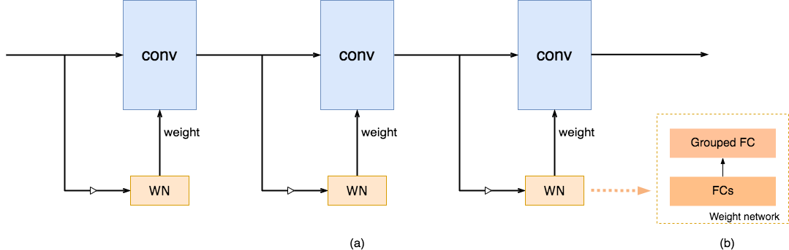
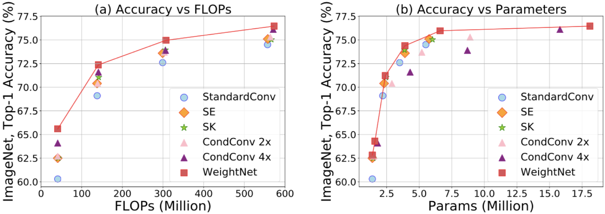

# [WeightNet]()
This repository provides MegEngine implementation for "[WeightNet: Revisiting the Design Space of Weight Network](https://arxiv.org/pdf/2007.11823.pdf)".

<!--  -->


## Requirement
- MegEngine (https://github.com/MegEngine/MegEngine)


## Citation
If you use these models in your research, please cite:


    @inproceedings{ma2020weightnet, 
                title={WeightNet: Revisiting the Design Space of Weight Networks},  
                author={Ma, Ningning and Zhang, Xiangyu and Huang, Jiawei and Sun, Jian},  
                booktitle={Proceedings of the European Conference on Computer Vision (ECCV)},  
                year={2020} 
    }

## Usage
Train:
```
    python3 train.py --dataset-dir=/path/to/imagenet
```

Eval:
```
    python3 test.py --data=/path/to/imagenet --model /path/to/model --ngpus 1
```

Inference:
```
    python3 inference.py --model /path/to/model --image /path/to/image.jpg
```


## Trained Models
- OneDrive download: [Link](https://1drv.ms/u/s!AgaP37NGYuEXhVa4o5xbveef89Ba?e=Xvg6Vo)

## Results

<!--  -->



- Comparison under the same #Params and the same FLOPs.


| Model               | #Params. | FLOPs | Top-1 err. |
|---------------------|----------|-------|------------|
| ShuffleNetV2 (0.5×) | 1.4M     | 41M   | 39.7       |
| + WeightNet (1×)    | 1.5M     | 41M   | **36.7**   |
| ShuffleNetV2 (1.0×) | 2.2M     | 138M  | 30.9       |
| + WeightNet (1×)    | 2.4M     | 139M  | **28.8**   |
| ShuffleNetV2 (1.5×) | 3.5M     | 299M  | 27.4       |
| + WeightNet (1×)    | 3.9M     | 301M  | **25.6**   |
| ShuffleNetV2 (2.0×) | 5.5M     | 557M  | 25.5       |
| + WeightNet (1×)    | 6.1M     | 562M  | **24.1**   |


- Comparison under the same FLOPs.


| Model               | #Params. | FLOPs | Top-1 err. |
|---------------------|----------|-------|------------|
| ShuffleNetV2 (0.5×) | 1.4M     | 41M   | 39.7       |
| + WeightNet (8×)    | 2.7M     | 42M   | **34.0**   |
| ShuffleNetV2 (1.0×) | 2.2M     | 138M  | 30.9       |
| + WeightNet (4×)    | 5.1M     | 141M  | **27.6**   |
| ShuffleNetV2 (1.5×) | 3.5M     | 299M  | 27.4       |
| + WeightNet (4×)    | 9.6M     | 307M  | **25.0**   |
| ShuffleNetV2 (2.0×) | 5.5M     | 557M  | 25.5       |
| + WeightNet (4×)    | 18.1M    | 573M  | **23.5**   |
