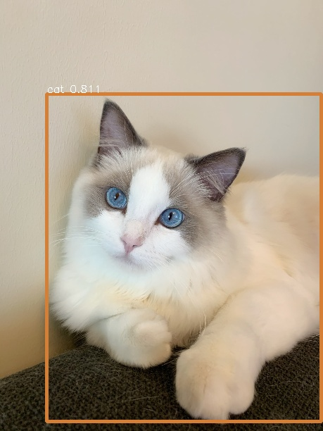

# Megengine Object Detection Models

## 介绍

本目录包含了采用MegEngine实现的如下经典网络结构，并提供了在COCO2017数据集上的完整训练和测试代码：

- [RetinaNet](https://arxiv.org/abs/1708.02002)
- [Faster R-CNN](https://arxiv.org/abs/1612.03144)
- [FCOS](https://arxiv.org/abs/1904.01355)
- [ATSS](https://arxiv.org/abs/1912.02424)

网络在COCO2017验证集上的性能和结果如下：

| 模型                                | mAP<br>@5-95 | batch<br>/gpu |
| ---                                 | :---:        | :---:         |
| retinanet-res50-coco-1x-800size     | 37.0         | 2             |
| retinanet-res101-coco-2x-800size    | 41.1         | 2             |
| retinanet-resx101-coco-2x-800size   | 42.7         | 2             |
| faster-rcnn-res50-coco-1x-800size   | 38.0         | 2             |
| faster-rcnn-res101-coco-2x-800size  | 42.5         | 2             |
| faster-rcnn-resx101-coco-2x-800size | 43.6         | 2             |
| fcos-res50-coco-1x-800size          | 39.7         | 2             |
| fcos-res101-coco-2x-800size         | 44.1         | 2             |
| fcos-resx101-coco-2x-800size        | 44.9         | 2             |
| atss-res50-coco-1x-800size          | 40.1         | 2             |
| atss-res101-coco-2x-800size         | 44.5         | 2             |
| atss-resx101-coco-2x-800size        | 45.9         | 2             |

## 安装和环境配置

本目录下代码基于MegEngine v1.0，在开始运行本目录下的代码之前，请确保按照[README](../../../README.md)进行了正确的环境配置。

## 如何使用

以RetinaNet为例，模型训练好之后，可以通过如下命令测试单张图片：

```bash
python3 tools/inference.py -f configs/retinanet_res50_coco_1x_800size.py \
                           -w /path/to/model_weights.pkl \
                           -i ../../assets/cat.jpg
```

`tools/inference.py`的命令行选项如下:

- `-f`, 测试的网络结构描述文件。
- `-w`, 需要测试的模型权重。
- `-i`, 需要测试的样例图片。

使用默认图片和默认模型测试的结果见下图:



## 如何训练

以RetinaNet在COCO2017数据集上训练为例。

1. 在开始训练前，请确保已经下载解压好[COCO2017数据集](http://cocodataset.org/#download)，
并放在合适的数据目录下，准备好的数据集的目录结构如下所示(目前默认使用COCO2017数据集)：

```
/path/to/
    |->coco
    |    |annotations
    |    |train2017
    |    |val2017
```

2. 准备预训练的`backbone`网络权重：可使用 megengine.hub 下载`megengine`官方提供的在ImageNet上训练的模型, 并存放在 `/path/to/pretrain.pkl`。

3. 开始训练:

```bash
python3 tools/train.py -f configs/retinanet_res50_coco_1x_800size.py -n 8 \
                       -d /path/to/COCO2017
```

`tools/train.py`的命令行选项如下：

- `-f`, 所需要训练的网络结构描述文件。
- `-n`, 用于训练的devices(gpu)数量。
- `-w`, 预训练的backbone网络权重。
- `-b`，训练时采用的`batch size`, 默认2，表示每张卡训2张图。
- `-d`, 数据集的上级目录，默认`/data/datasets`。

默认情况下模型会存在 `log-of-模型名`目录下。

## 如何测试

以RetinaNet在COCO2017数据集上测试为例。

在得到训练完保存的模型之后，可以通过tools下的test.py文件测试模型在验证集上的性能。

验证某个epoch的性能：

```bash
python3 tools/test.py -f configs/retinanet_res50_coco_1x_800size.py -n 8 \
                      -se 15 \
                      -d /path/to/COCO2017
```

验证连续若干个epoch性能：
```bash
python3 tools/test.py -f configs/retinanet_res50_coco_1x_800size.py -n 8 \
                      -se 15 -ee 17 \
                      -d /path/to/COCO2017
```

验证某个指定weights的性能：

```bash
python3 tools/test.py -f configs/retinanet_res50_coco_1x_800size.py -n 8 \
                      -w /path/to/model_weights.pkl \
                      -d /path/to/COCO2017
```

`tools/test.py`的命令行选项如下：

- `-f`, 所需要测试的网络结构描述文件。
- `-n`, 用于测试的devices(gpu)数量。
- `-w`, 需要测试的模型权重。
- `-d`，数据集的上级目录，默认`/data/datasets`。
- `-se`，连续测试的起始epoch数，默认为最后一个epoch，该参数的值必须大于等于0且小于模型的最大epoch数。
- `-ee`，连续测试的结束epoch数，默认等于`-se`（即只测试1个epoch），该参数的值必须大于等于`-se`且小于模型的最大epoch数。

## 参考文献

- [Focal Loss for Dense Object Detection](https://arxiv.org/abs/1708.02002) Tsung-Yi Lin, Priya Goyal, Ross Girshick, Kaiming He and Piotr Dollár. IEEE International Conference on Computer Vision (ICCV), 2017.
- [Faster R-CNN: Towards Real-Time Object Detection with Region Proposal Networks](https://arxiv.org/abs/1506.01497) Shaoqing Ren, Kaiming He, Ross Girshick, and Jian Sun. Neural Information Processing Systems (NIPS), 2015.
- [Feature Pyramid Networks for Object Detection](https://arxiv.org/abs/1612.03144) Tsung-Yi Lin, Piotr Dollár, Ross Girshick, Kaiming He, Bharath Hariharan and Serge Belongie. IEEE Conference on Computer Vision and Pattern Recognition (CVPR), 2017.
- [FCOS: Fully Convolutional One-Stage Object Detection](https://arxiv.org/abs/1904.01355) Zhi Tian, Chunhua Shen, Hao Chen, and Tong He. IEEE International Conference on Computer Vision (ICCV), 2019.
- [Bridging the Gap Between Anchor-based and Anchor-free Detection via Adaptive Training Sample Selection](https://arxiv.org/abs/1912.02424) Shifeng Zhang, Cheng Chi, Yongqiang Yao, Zhen Lei, and Stan Z. Li. IEEE Conference on Computer Vision and Pattern Recognition (CVPR), 2020.
- [Microsoft COCO: Common Objects in Context](https://arxiv.org/abs/1405.0312) Tsung-Yi Lin, Michael Maire, Serge Belongie, James Hays, Pietro Perona, Deva Ramanan, Piotr Dollár, and C Lawrence Zitnick. European Conference on Computer Vision (ECCV), 2014.
