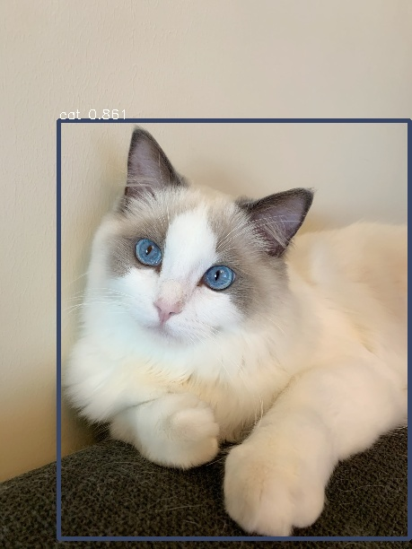

# Megengine Detection Models

## 介绍

本目录包含了采用MegEngine实现的经典网络结构，包括[RetinaNet](https://arxiv.org/pdf/1708.02002>)、[Faster R-CNN](https://arxiv.org/pdf/1612.03144.pdf)等，同时提供了在COCO2017数据集上的完整训练和测试代码。

网络的性能在COCO2017数据集上的测试结果如下：

| 模型                                     | mAP<br>@5-95 | batch<br>/gpu | gpu    | trainging speed<br>(8gpu) |
| ---                                      | :---:        | :---:         | :---:  | :---:                     |
| retinanet-res50-coco-1x-800size          | 36.4         | 2             | 2080Ti | 3.1(it/s)                 |
| retinanet-res50-coco-1x-800size-syncbn   | 37.1         | 2             | 2080Ti | 1.7(it/s)                 |
| faster-rcnn-res50-coco-1x-800size        | 38.8         | 2             | 2080Ti | 3.3(it/s)                 |
| faster-rcnn-res50-coco-1x-800size-syncbn | 39.3         | 2             | 2080Ti | 1.8(it/s)                 |

* MegEngine v0.4.0

## 如何使用

以RetinaNet为例，模型训练好之后，可以通过如下命令测试单张图片:

```bash
python3 tools/inference.py -f configs/retinanet_res50_coco_1x_800size.py \
                           -w /path/to/retinanet_weights.pkl
                           -i ../../assets/cat.jpg \
```

`tools/inference.py`的命令行选项如下:

- `-f`, 测试的网络结构描述文件。
- `-i`, 需要测试的样例图片。
- `-w`, 网络结构文件所对应的训练权重, 可以从顶部的表格中下载训练好的检测器权重。

使用默认图片和默认模型测试的结果见下图:



## 如何训练

1. 在开始训练前，请确保已经下载解压好[COCO2017数据集](http://cocodataset.org/#download)，
并放在合适的数据目录下，准备好的数据集的目录结构如下所示(目前默认使用COCO2017数据集)：

```
/path/to/
    |->coco
    |    |annotations
    |    |train2017
    |    |val2017
```

2. 准备预训练的`backbone`网络权重：可使用 megengine.hub 下载`megengine`官方提供的在ImageNet上训练的ResNet-50模型, 并存放在 `/path/to/pretrain.pkl`。

3. 在开始运行本目录下的代码之前，请确保按照[README](../../../README.md)进行了正确的环境配置。

4. 开始训练:

```bash
python3 tools/train.py -f configs/retinanet_res50_coco_1x_800size.py -n 8
```

`tools/train.py`提供了灵活的命令行选项，包括：

- `-f`, 所需要训练的网络结构描述文件。可以是RetinaNet、Faster R-CNN等.
- `-n`, 用于训练的devices(gpu)数量，默认使用所有可用的gpu.
- `-w`, 预训练的backbone网络权重的路径。
- `-b`，训练时采用的`batch size`, 默认2，表示每张卡训2张图。
- `-d`, COCO2017数据集的上级目录，默认`/data/datasets`。

默认情况下模型会存在 `log-of-模型名`目录下。

5. 编译可能需要的lib

GPU NMS位于tools下的GPU NMS文件夹下面，我们需要进入tools文件夹下进行编译.

首先需要找到MegEngine编译的头文件所在路径，可以通过命令

```bash
python3 -c "import megengine as mge; print(mge.__file__)"
```
将输出结果中__init__.py之前的部分复制(以MegEngine结尾)，将其赋值给shell变量MGE，接下来，运行如下命令进行编译。

```bash
cd tools
nvcc -I $MGE/_internal/include -shared -o lib_nms.so -Xcompiler "-fno-strict-aliasing -fPIC" gpu_nms/nms.cu
```

## 如何测试

在得到训练完保存的模型之后，可以通过tools下的test.py文件测试模型在`COCO2017`验证集的性能：

```bash
python3 tools/test.py -f configs/retinanet_res50_coco_1x_800size.py -n 8 \
                      -w /path/to/retinanet_weights.pt \
```

`tools/test.py`的命令行选项如下：

- `-f`, 所需要测试的网络结构描述文件。
- `-n`, 用于测试的devices(gpu)数量，默认1；
- `-w`, 需要测试的模型；可以从顶部的表格中下载训练好的检测器权重, 也可以用自行训练好的权重。
- `-d`，COCO2017数据集的上级目录，默认`/data/datasets`

## 参考文献

- [Focal Loss for Dense Object Detection](https://arxiv.org/pdf/1708.02002) Tsung-Yi Lin, Priya Goyal, Ross Girshick, Kaiming He, Piotr Dollár. Proceedings of the IEEE international conference on computer vision. 2017: 2980-2988.
- [Faster R-CNN: Towards Real-Time Object Detection with Region Proposal Networks](https://arxiv.org/pdf/1506.01497.pdf) S. Ren, K. He, R. Girshick, and J. Sun. In: Neural Information Processing Systems(NIPS)(2015).
- [Feature Pyramid Networks for Object Detection](https://arxiv.org/pdf/1612.03144.pdf) T. Lin, P. Dollár, R. Girshick, K. He, B. Hariharan and S. Belongie. 2017 IEEE Conference on Computer Vision and Pattern Recognition (CVPR), Honolulu, HI, 2017, pp. 936-944, doi: 10.1109/CVPR.2017.106.
- [Microsoft COCO: Common Objects in Context](https://arxiv.org/pdf/1405.0312.pdf)  Lin, Tsung-Yi and Maire, Michael and Belongie, Serge and Hays, James and Perona, Pietro and Ramanan, Deva and Dollár, Piotr and Zitnick, C Lawrence, Lin T Y, Maire M, Belongie S, et al. European conference on computer vision. Springer, Cham, 2014: 740-755.
