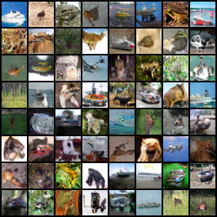

Generative Adversarial Networks
---

This directory provides code to build, train and evaluate popular GAN models including DCGAN and WGAN. Most of the code are modified from a well-written and reproducible GAN benchmark [pytorch_mimicry](https://github.com/kwotsin/mimicry).

We provide pretrained DCGAN and WGAN on cifar10. They use similar ResNet backbone and share the same training setting.



#### Training Parameters
| Resolution | Batch Size | Learning Rate | β<sub>1</sub> | β<sub>2</sub> | Decay Policy | n<sub>dis</sub> | n<sub>iter</sub> |
|:----------:|:----------:|:-------------:|:-------------:|:-------------:|:------------:|:---------------:|------------------|
| 32 x 32 | 64 | 2e-4 | 0.0 | 0.9 | Linear | 5 | 100K |

Their FID and Inception Score(IS) are listed below.

#### Metrics
| Metric | Method |
|:--------------------------------:|:---------------------------------------:|
| [Inception Score (IS)](https://arxiv.org/abs/1606.03498) | 50K samples at 10 splits|
| [Fréchet Inception Distance (FID)](https://arxiv.org/abs/1706.08500) | 50K real/generated samples |
| [Kernel Inception Distance (KID)](https://arxiv.org/abs/1801.01401) | 50K real/generated samples, averaged over 10 splits.|


#### Cifar10 Results
| Method | FID Score | IS Score | KID Score |
| :-: | :-: | :-: | :-: |
| DCGAN  | 27.2 | 7.0 | 0.0242 |
| WGAN-WC  | 30.5  | 6.7 | 0.0249 |

### Generate images with pretrained weights

```python
import megengine.hub as hub
import megengine_mimicry.nets.dcgan.dcgan_cifar as dcgan
import megengine_mimicry.utils.vis as vis

netG = dcgan.DCGANGeneratorCIFAR()
netG.load_state_dict(hub.load_serialized_obj_from_url("https://data.megengine.org.cn/models/weights/dcgan_cifar.pkl"))
images = dcgan_generator.generate_images(num_images=64)  # in NCHW format with normalized pixel values in [0, 1]
grid = vis.make_grid(images)  # in HW3 format with [0, 255] BGR images for visualization
vis.save_image(grid, "visual.png")
```

### Train and evaluate a DCGAN or WGAN

```bash
# train and evaluate a DCGAN
python3 train_dcgan.py
# train and evaluate a WGAN
python3 train_wgan.py
```

#### Tensorboard visualization
```bash
tensorboard --logdir ./log --bind_all
```
