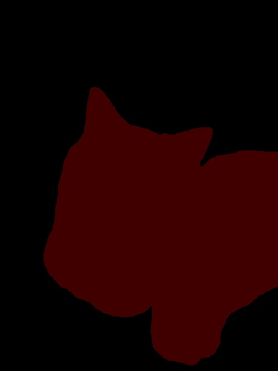

# Megengine Semantic Segmentation Models

## 介绍

本目录包含了采用MegEngine实现的经典[DeepLabV3+](https://arxiv.org/abs/1802.02611.pdf)网络结构，同时提供了在Pascal VOC2012和Cityscapes数据集上的完整训练和测试代码。

网络在Pascal VOC2012验证集上的性能和结果如下：

| 模型                             | mIoU |
| ---                              | :--: |
| deeplabv3plus-res101-voc-512size | 79.5 |

网络在Cityscapes验证集上的性能和结果如下：

| 模型                                    | mIoU |
| ---                                     | :--: |
| deeplabv3plus-res101-cityscapes-768size | 78.5 |

## 安装和环境配置

本目录下代码基于MegEngine v1.1，在开始运行本目录下的代码之前，请确保按照[README](../../../README.md)进行了正确的环境配置。

## 如何使用

以DeepLabV3+为例，模型训练好之后，可以通过如下命令测试单张图片：

```bash
python3 tools/inference.py -f configs/deeplabv3plus_res101_voc_512size.py \
                           -w /path/to/model_weights.pkl \
                           -i ../../assets/cat.jpg
```

`tools/inference.py`的命令行选项如下:

- `-f`, 测试的网络结构描述文件。
- `-w`, 需要测试的模型权重。
- `-i`, 需要测试的样例图片。

使用默认图片和默认模型测试的结果见下图:



## 如何训练

以DeepLabV3+在Pascal VOC2012数据集上训练为例。

1. 在开始训练前，请下载[Pascal VOC2012数据集](http://host.robots.ox.ac.uk/pascal/VOC/voc2012/#data)，并解压到合适的目录下。为保证一样的训练环境，还需要下载[SegmentationClassAug](https://www.dropbox.com/s/oeu149j8qtbs1x0/SegmentationClassAug.zip?dl=0&file_subpath=%2FSegmentationClassAug)。具体可以参照这个[流程](https://www.sun11.me/blog/2018/how-to-use-10582-trainaug-images-on-DeeplabV3-code/)。

准备好的 VOC 数据目录结构如下：

```
/path/to/
    |->VOC2012
    |    |Annotations
    |    |ImageSets
    |    |JPEGImages
    |    |SegmentationClass
    |    |SegmentationClass_aug
```

其中，ImageSets/Segmentation中包含了[trainaug.txt](https://gist.githubusercontent.com/sun11/2dbda6b31acc7c6292d14a872d0c90b7/raw/5f5a5270089239ef2f6b65b1cc55208355b5acca/trainaug.txt)。

注意：SegmentationClass_aug和SegmentationClass中的数据格式不同。

2. 准备预训练的`backbone`网络权重：可使用 megengine.hub 下载`megengine`官方提供的在ImageNet上训练的模型, 并存放在 `/path/to/pretrain.pkl`。

3. 开始训练:

```bash
python3 tools/train.py -f configs/deeplabv3plus_res101_voc_512size.py -n 8 \
                       -d /path/to/VOC2012
```

`tools/train.py`的命令行选项如下：

- `-f`, 所需要训练的网络结构描述文件。
- `-n`, 用于训练的devices(gpu)数量。
- `-w`, 预训练的backbone网络权重。
- `-d`, 数据集的上级目录，默认`/data/datasets`。
- `-r`, 是否从已训好的模型继续训练，默认`None`。

默认情况下模型会存在 `log-of-模型名`目录下。

## 如何测试

以DeepLabV3+在Pascal VOC2012数据集上测试为例。

在得到训练完保存的模型之后，可以通过tools下的test.py文件测试模型在验证集上的性能。

```bash
python3 tools/test.py -f configs/deeplabv3plus_res101_voc_512size.py -n 8 \
                      -w /path/to/model_weights.pkl \
                      -d /path/to/VOC2012
```

`tools/test.py`的命令行选项如下：

- `-f`, 所需要测试的网络结构描述文件。
- `-n`, 用于测试的devices(gpu)数量。
- `-w`, 需要测试的模型权重。
- `-d`，数据集的上级目录，默认`/data/datasets`。

## 参考文献

- [Encoder-Decoder with Atrous Separable Convolution for Semantic Image Segmentation](https://arxiv.org/abs/1802.02611) Liang-Chieh Chen, Yukun Zhu, George Papandreou, Florian Schroff, and Hartwig Adam. European Conference on Computer Vision (ECCV), 2018.